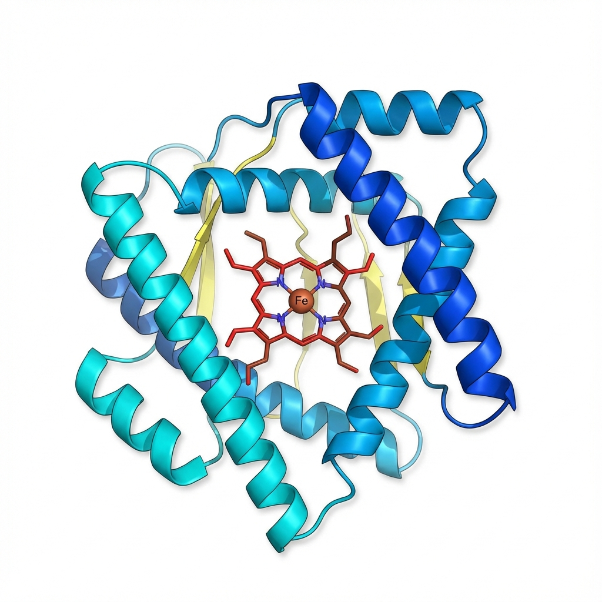
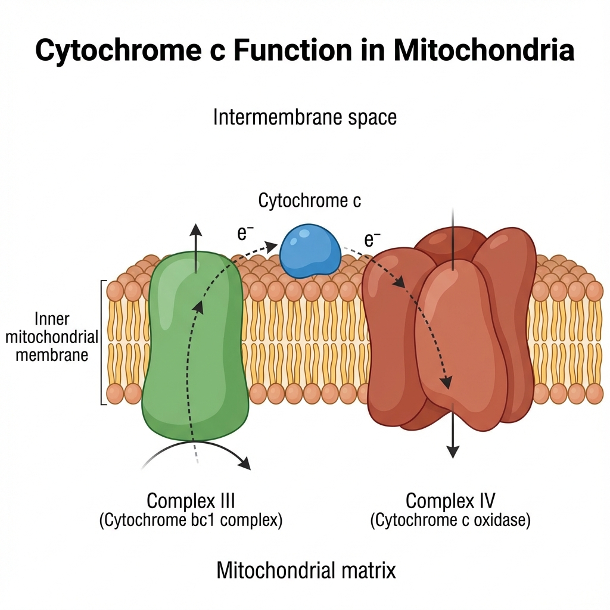

# AlphaFold & PyMOL - Análisis de Proteínas

Este repositorio contiene ejercicios prácticos para el análisis de estructuras de proteínas utilizando **AlphaFold** y **PyMOL**, enfocándose en la comparación entre predicciones computacionales y estructuras experimentales.

## Proteína de Estudio: Cytochrome c (CYCS)

<div align="center">
  
  <p><i>Estructura 3D del Cytochrome c mostrando α-hélices y el grupo heme</i></p>
</div>

>*Imagen generada con Gemini 3 Pro Image*

### Información General

| Propiedad | Valor |
|-----------|-------|
| **Nombre** | Cytochrome c (CYCS) |
| **UniProt ID** | [P99999](https://www.uniprot.org/uniprotkb/P99999) |
| **PDB Experimental** | [1HRC](https://www.rcsb.org/structure/1HRC) |
| **Longitud** | 105 aminoácidos |
| **Peso Molecular** | ~12 kDa |
| **Organismo** | *Homo sapiens* |
| **Localización** | Espacio intermembrana mitocondrial |
| **Cofactor** | Grupo heme c |

### Función Biológica

<div align="center">
  
  <p><i>Función del Cytochrome c en la cadena de transporte de electrones</i></p>
</div>

>*Imagen generada con Gemini 3 Pro Image*

**Cytochrome c** desempeña dos funciones críticas:

1. **⚡ Cadena de transporte de electrones**: Transfiere electrones entre el Complejo III (citocromo bc1) y el Complejo IV (citocromo c oxidasa) en la mitocondria, siendo esencial para la producción de ATP.

2. **💀 Señalización de apoptosis**: Cuando se libera al citosol, activa la cascada de caspasas que conduce a la muerte celular programada.

## Contenido del Repositorio

```
alphafold-pymol/
├── alphafold-exercises.ipynb    # Notebook principal con ejercicios
├── images/                       # Imágenes de la proteína
│   ├── cytochrome_c_structure.png
│   └── cytochrome_c_function.png
└── PDB/                         # Estructuras descargadas
    └── AF-P99999-F1-model_v6.pdb
```

## Objetivos del Proyecto

Este proyecto tiene como objetivo:

- Descargar y analizar secuencias de proteínas desde UniProt
- Obtener predicciones estructurales de AlphaFold
- Visualizar estructuras 3D con py3Dmol y PyMOL
- Analizar la confianza de predicción mediante valores pLDDT
- Comparar predicciones con estructuras experimentales (RMSD)
- Generar mapas de distancias internas
- Identificar regiones flexibles y sitios activos

## Ejercicios Incluidos

### Bloque 1: Descarga de Secuencia desde UniProt
Obtención de la secuencia FASTA y análisis de anotaciones biológicas.

### Bloque 2: Descarga del Modelo AlphaFold
Descarga y visualización de la estructura predicha por AlphaFold.

### Bloque 3: Extracción de pLDDT
Análisis de valores de confianza (pLDDT) desde el archivo PDB.

### Bloque 4: Gráfico de pLDDT por Residuo
Visualización de la confianza de predicción a lo largo de la secuencia.

### Bloque 5: Colorear por pLDDT
Representación 3D con esquema de colores según confianza.

### Bloque 6: Comparación con Estructura Experimental
Cálculo de RMSD entre AlphaFold y estructura experimental (1HRC).

### Bloque 7: Mapa de Distancias CA–CA
Generación de mapa de calor de distancias entre átomos Cα.

## Aspectos Interesantes del Cytochrome c

| Característica | Descripción | Relevancia para AlphaFold |
|----------------|-------------|---------------------------|
| **Sitio activo** | Grupo heme unido a Cys14 y Cys17 | ¿Predice correctamente la geometría? |
| **Ligandos del hierro** | His18 y Met80 | ¿Identifica residuos clave? |
| **Loop Ω** | Residuos 70-85 (región flexible) | ¿Captura la flexibilidad? |
| **Conservación evolutiva** | Altamente conservada | Excelente para estudios comparativos |

## Configuración del Entorno y Ejecución

### Requisitos del Sistema
- Python 3.9 o superior
- pip (gestor de paquetes de Python)
- Jupyter Notebook (opcional, para ejecutar el notebook)

### Instalación

#### 1. Crear Entorno Virtual
```bash
# Navegar al directorio del proyecto
cd alphafold-pymol

# Crear entorno virtual
python3 -m venv venv

# Activar el entorno virtual
source venv/bin/activate  # En macOS/Linux
# o
venv\Scripts\activate     # En Windows
```

#### 2. Instalar Dependencias
```bash
# Con el entorno virtual activado
pip install biopython
pip install py3Dmol
pip install matplotlib
pip install numpy
pip install jupyter  # Si deseas usar Jupyter Notebook
```

#### 3. Verificar Instalación
```bash
python -c "import Bio; print('Biopython:', Bio.__version__)"
python -c "import numpy; print('NumPy:', numpy.__version__)"
python -c "import matplotlib; print('Matplotlib:', matplotlib.__version__)"
```

### Ejecución de Ejercicios

#### Opción 1: Scripts Python Individuales
```bash
# Activar entorno virtual
source venv/bin/activate

# Ejecutar ejercicio específico (ejemplo)
python bloque1_descarga_secuencia.py
```

#### Opción 2: Jupyter Notebook
```bash
# Activar entorno virtual
source venv/bin/activate

# Iniciar Jupyter Notebook
jupyter notebook

# Abrir alphafold-exercises.ipynb en el navegador
```

### Solución de Problemas Comunes

- **Error "ModuleNotFoundError":** Asegúrate de tener activado el entorno virtual (`source venv/bin/activate`).
- **Error "externally-managed-environment":** Evita instalar paquetes globalmente; usa siempre el entorno virtual como se indica arriba.


## Resultados Esperados

- **pLDDT medio esperado**: >90 en el core, ~70-85 en loops
- **RMSD esperado**: <2 Å (predicción de alta calidad)
- **Regiones de alta confianza**: Core de α-hélices
- **Regiones de menor confianza**: Loop Ω y terminales

---

